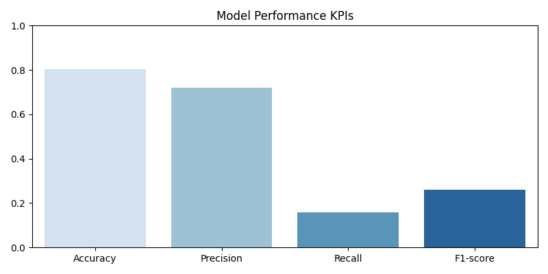
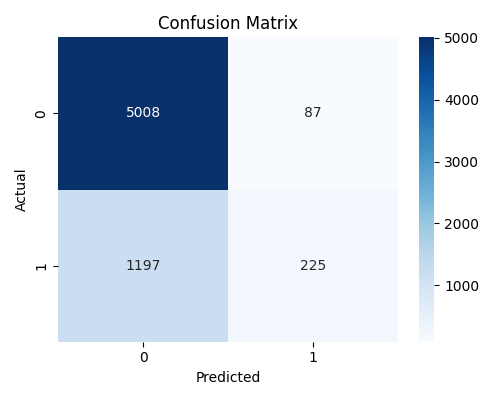
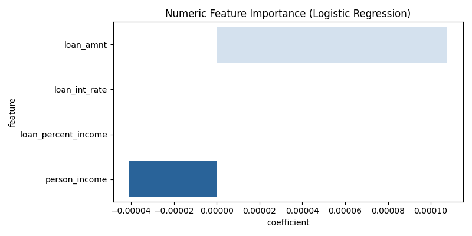
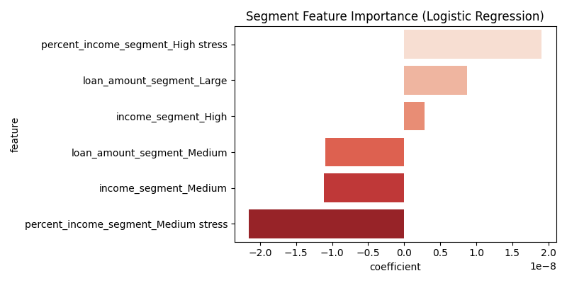

# Risk Driven Data Insights

This project builds and evaluates a baseline credit risk model using Logistic Regression.  
The goal is to understand default risk drivers, visualize model performance, and create an interpretable foundation for more advanced models.

---

## Project Structure

```
data/ – dataset  
notebooks/ – analysis and modeling (01–06)  
results/ – saved outputs (coefficients, metrics)  
visuals/ – final visualizations  
README.md – project overview
```

---

## How to Run

Install dependencies:

```bash
pip install -r requirements.txt
```

Open Jupyter Notebook:

```bash
jupyter notebook
```

Run notebooks in order: **01 → 06**

---

## Key Results

- Accuracy: 0.803  
- Precision: 0.721  
- Recall: 0.158  
- F1-score: 0.260  

Main risk drivers: income, loan amount, payment burden  
Segment insights: high stress and large loans increase risk

---

## Dashboard Preview






---

## Why This Project Matters

Credit risk modeling is essential for lending decisions.  
This project shows how simple, interpretable models can reveal clear risk patterns and support practical decision-making.

---

## Tech Stack

- Python  
- Pandas  
- NumPy  
- Scikit-learn  
- Seaborn  
- Matplotlib  
- Jupyter Notebook

---

## Future Improvements

- Class balancing (class weights or SMOTE)  
- Tree-based models (Random Forest, XGBoost)  
- Scaling numeric features  
- Optional model comparison dashboard

---

## Contact

Created by Aarni
